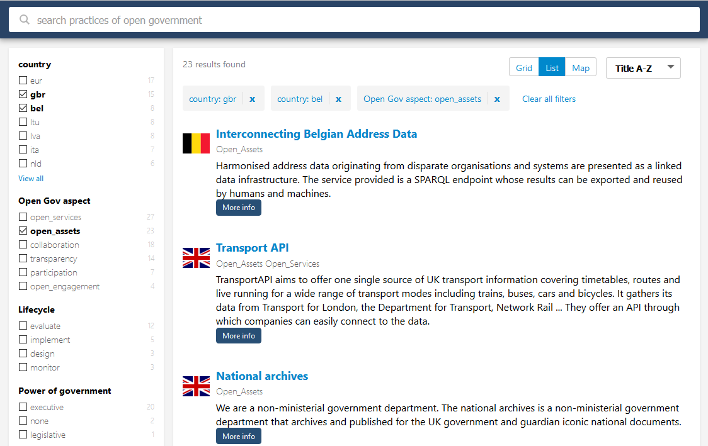
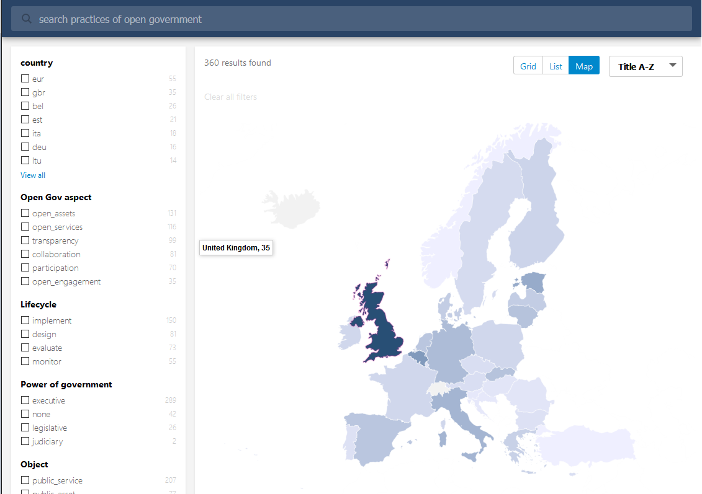

## What is this app?
This the code of web app built using [SearchKit](http://searchkit.co/), [datamaps 0.5.5](http://datamaps.github.io/), [flag-icon-css](http://lipis.github.io/flag-icon-css/), [react-bootstrap](https://react-bootstrap.github.io/).
- Facetted search using [ElasticSearch Search](https://www.elastic.co/).
- Coloured map view of country results (choropleth) using [datamaps 0.5.5](http://datamaps.github.io/).

## Live demo
[http://opengov.testproject.eu/](http://opengov.testproject.eu/ "Search open gov practices".)

## Getting started
- npm install
- manually copy [flag-icon-css](http://lipis.github.io/flag-icon-css/) and [datamaps 0.5.5](http://datamaps.github.io/) into your nodes_modules folder.
- npm start